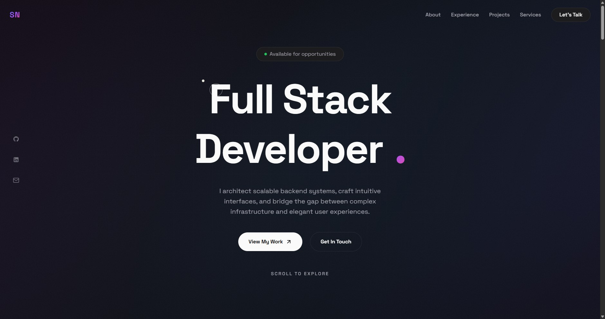

# Portfolio

Personal portfolio built with Astro.



## Tech Stack

- **Framework:** Astro
- **Styling:** SCSS with CSS custom properties
- **Animations:** GSAP + ScrollTrigger
- **Icons:** astro-icon (Lucide + MDI)
- **Forms:** Web3Forms + hCaptcha

## Getting Started

```bash
# Install dependencies
bun install

# Start dev server
bun dev

# Build for production
bun build
```

## Environment Variables

Create a `.env` file:

```
PUBLIC_WEB3FORMS_ACCESS_KEY=your_key_here
```

Get your access key from [web3forms.com](https://web3forms.com).
